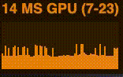
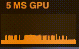

Fork of [mrdoob/stats.js](https://github.com/mrdoob/stats.js)
========

```
npm install stats.js@marcofugaro/stats.js
```

### CHANGES

- Convert to ES6 classes
- Add GPU MS panel from [brunosimon](https://github.com/brunosimon/threejs-points-physical-material/blob/main/src/javascript/Utils/Stats.js): `new Stats({ context: renderer.getContext() })`
- Add option to hide min and max: `new Stats({ showMinMax: false })`
- Fix jumping around of text:

| Before | After |
|-------|--------|
|  |  |